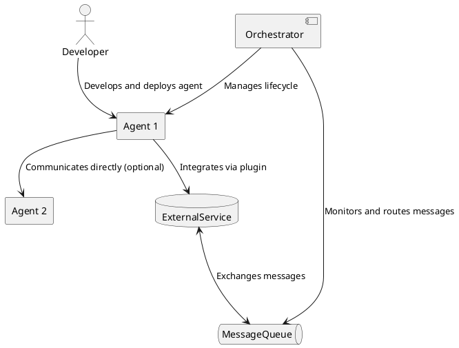

Below is a basic example that demonstrates
how to create and run your first agent:

```bash
# Initialize a new project
npx architect init my-first-project

# Create a simple agent
architect create agent GreetingAgent --template basic

# Run the project
cd my-first-project && npm start
```

This will create a minimal system with a single agent that logs a greeting message to the
console.

### System Architecture

Below is a high-level overview of how the different components of Architect interact with each
other:



### Key Features

- **Autonomous Decision Making**: Agents can make decisions based on their current state and the
  information they receive.
- **Extensive Plugin System**: Easily extend the functionality of your agents with a wide range
  of plugins.
- **Scalable Architecture**: Architect is designed to scale horizontally, making it suitable for
  systems of all sizes.
- **Robust Security**: Built-in security features ensure that your system is protected from
  unauthorized access and malicious activities.
- **Workflow Management**: Define and manage complex workflows with ease using a simple,
  declarative syntax.
- **Integration Capabilities**: Seamlessly integrate with external services and systems using
  pre-built connectors.
- **Developer Tools**: A comprehensive set of tools to streamline development, debugging, and
  deployment.

### Why Choose Architect?

Architect offers several advantages that make it an ideal choice for building modern distributed
systems:

1. **Flexibility**: With its modular design, Architect allows you to build systems tailored to
   your specific needs.
2. **Efficiency**: By abstracting away low-level complexities, Architect enables you to focus on
   writing business logic rather than boilerplate code.
3. **Extensibility**: The plugin system makes it easy to add new features and capabilities as
   your system evolves.
4. **Future-Proof**: Built using modern technologies and design patterns, Architect ensures that
   your system remains relevant in the face of rapidly changing requirements.

### Roadmap

The development of Architect is an ongoing process, with several exciting features planned for
future releases:

1. **Visual Workflow Editor**: A graphical interface for designing and managing workflows.
2. **Advanced Monitoring and Analytics**: Enhanced monitoring capabilities with real-time
   analytics and customizable dashboards.
3. **AI Integration**: Incorporate artificial intelligence to enable agents to make more
   sophisticated decisions.
4. **Edge Computing Support**: Extend Architect's capabilities to edge computing environments.
