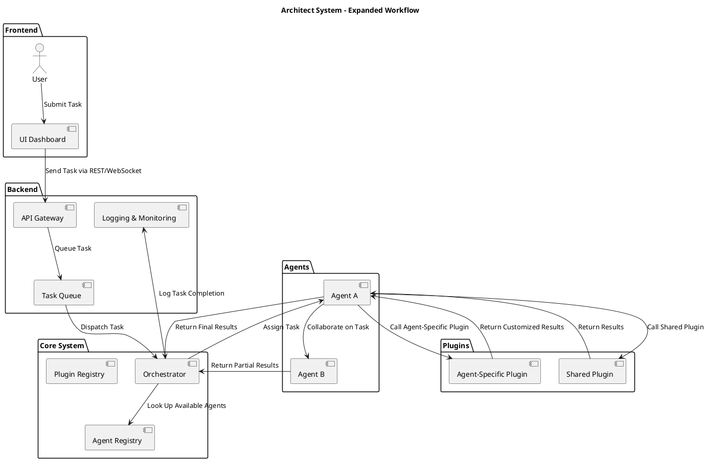

Architect is a scalable, modular framework designed to simplify the development of agent-oriented systems. By leveraging
modern software principles such as microservices, event-driven workflows, and plugin-based extensibility, Architect
enables developers to build flexible, maintainable, and high-performance applications.

## What is Architect?

Architect provides an orchestrator for managing agents, a plugin system for extending functionality, and a structured task
management workflow to ensure seamless execution of automated processes. The framework is particularly well-suited for
large-scale, dynamic environments where adaptability and modularity are key.

## Architectural Overview

The following diagram illustrates the high-level architecture of Architect:



This diagram shows the flow of tasks through the system, from user submission to task completion and logging.

## Key Features of Architect

### Core Functionality

- **Agent Management**: Scalable orchestration of agents for distributed task execution.
- **Plugin System**: Extensible architecture for adding custom functionality.
- **Task Queue**: Reliable task distribution and management.
- **Logging & Monitoring**: Comprehensive system observability.

### Design Principles

- **Modularity**: Components are loosely coupled for flexibility and maintainability.
- **Extensibility**: Easily add new agents, plugins, or integrations.
- **Performance**: Optimized for high-throughput and low-latency environments.
- **Resilience**: Built-in fault tolerance and error handling.

## Why Architect?

### Flexibility and Customization

Architect is designed to adapt to a wide range of use cases. Whether you're building a distributed workflow engine, an IoT
platform, or a microservices ecosystem, Architect provides the foundation for your system.

### Use Cases

- **Distributed Task Execution**: Run tasks across multiple agents in parallel.
- **Event-Driven Systems**: Process events in real-time with configurable handlers.
- **Custom Workflows**: Define complex workflows using a visual or code-based interface.
- **Integration Hub**: Connect disparate systems using plugins and adapters.

### Developer Benefits

- **Simplified Complexity**: Abstract away low-level details and focus on business logic.
- **Rapid Development**: Leverage pre-built components and tools to accelerate development.
- **Community Support**: Join an active community of developers and contributors.

## Getting Started

Here’s a quick guide to getting started with Architect:

### Prerequisites

- Node.js (or your preferred runtime environment)
- Docker (optional but recommended for containerized deployments)

### Installation

```bash
# Install dependencies
npm install @architect/core

# Initialize a new project
npx architect init my-project
```

### Basic Usage

```javascript
const { Architect } = require("@architect/core")

// Create a new instance of Architect
const architect = new Architect()

// Register an agent
architect.registerAgent({
  name: "example-agent",
  task: async () => {
    console.log("Task executed!")
    return { status: "success" }
  },
})

// Start the system
architect.start()
```

### Running in Production

```bash
# Build and start the application
npm run build && npm run start

# Or use Docker
docker-compose up -d
```

## Next Steps

### Explore Features

- Learn about agents, plugins, and workflows.
- Check out our [examples repository](https://architect.codingbutter.com/example) for real-world use cases.

### Documentation

Visit the [official documentation](https://architect.codingbutter.com/docs/) for in-depth guides and API references.

### Community & Support

Join our [Discord server](https://discord.gg/architect) or [GitHub
discussions](https://github.com/codingbutter/architect_environment/discussions) to connect with other developers.

## Contributing

Architect is an open-source project and we welcome contributions from the community. Whether you’re fixing bugs, improving
documentation, or adding new features, your input helps shape the future of the framework.

### Getting Involved

1. Read our [Contributing Guide](https://github.com/architaect_environment/main/blob/main/CONTRIBUTING.md).
2. Check out open issues on [GitHub](https://github.com/architect_environment/main/issues).
3. Join the conversation in our community channels.

## Conclusion

Architect is more than just a framework—it’s a platform for building the future of distributed systems. With its modular
architecture, extensible design, and powerful features, Architect empowers developers to create scalable, resilient, and
maintainable applications.

Welcome to Architect – the future of modular, agent-driven automation!
