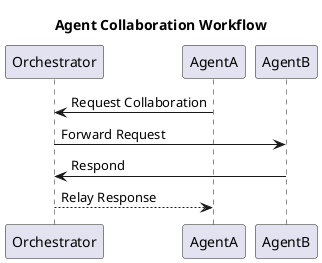

# Agent-to-Agent Communication

Collaboration between agents is crucial for handling complex workflows in the Architect AI framework. Agents communicate to share data, delegate tasks, and synchronize actions efficiently.

## Communication Mechanisms

1. **Orchestrator Mediation**:

   - All agent communications are routed through the orchestrator for centralized control.
   - The orchestrator ensures secure and efficient message delivery.

2. **Direct Messaging**:
   - In specific scenarios, agents can communicate directly with each other when the orchestrator grants permission.
   - This reduces latency and allows faster synchronization.

## Workflow Diagram

## Use Cases

### Data Sharing

- **Scenario**: Agent A processes raw data and needs to share it with Agent B for further analysis.
- **Workflow**:
  1. Agent A sends the processed data to the orchestrator.
  2. The orchestrator forwards the data to Agent B.

### Task Delegation

- **Scenario**: A complex task requires multiple agents working in sequence.
- **Workflow**:
  1. The orchestrator assigns the first task to Agent A.
  2. Upon completion, Agent A triggers Agent B through the orchestrator.

## Security and Permissions

1. **Authentication**:

   - Agents authenticate their identity before initiating communication.

2. **Authorization**:

   - The orchestrator verifies whether an agent is allowed to communicate with another agent.

3. **Audit Logs**:
   - All inter-agent communications are logged for traceability and debugging.

## Monitoring

- **Real-Time Monitoring**: View active agent communications and their statuses.
- **Historical Data**: Analyze past interactions to optimize workflows and identify bottlenecks.

Agent-to-agent communication ensures that Architect AI remains a robust and scalable framework capable of handling diverse and complex workflows efficiently.
