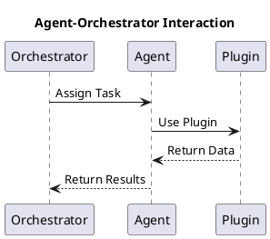

The interaction between agents and the orchestrator forms the backbone of Architect's task management system.

## Workflow

The orchestrator receives tasks from the frontend or backend and delegates them to agents for processing. The agents can call tools, plugins, and even other agents to accomplish the task.

This design ensures scalability and flexibility, allowing agents to perform specialized roles while the orchestrator oversees the process.
