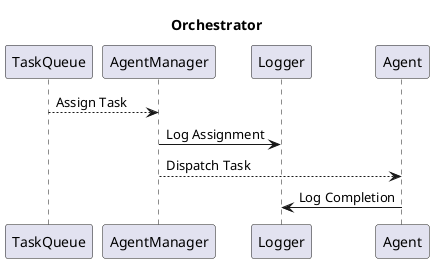
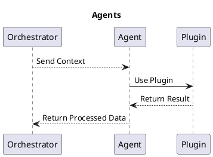
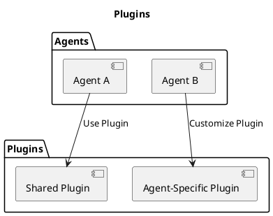

Architect is built around several key components to provide a robust and scalable architecture:

## Orchestrator

The orchestrator acts as the central hub for managing tasks and agent interactions.

## Agents

Agents are modular, task-specific entities designed to handle logic independently.

## Plugins

Plugins extend the capabilities of agents by providing reusable logic and integration with external systems.

These components together ensure that Architect remains highly extensible and easy to maintain.
