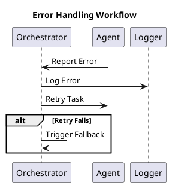

# Error Handling and Recovery

Errors are an inevitable part of any complex system. Architect AI ensures robust handling and recovery mechanisms to maintain system stability and reliability.

## Key Strategies

1. **Logging and Alerts**:
   - All errors are logged with detailed metadata, including timestamps, error type, and context.
   - Critical errors trigger alerts, notifying administrators or automated monitoring systems.
2. **Retry Mechanisms**:
   - Tasks are retried with an exponential backoff strategy to handle transient issues.
   - The orchestrator tracks retry attempts to avoid endless loops.
3. **Fallbacks**:
   - Alternate workflows or agents are triggered if the primary execution path fails.
   - Example: If a plugin fails to process a request, a backup plugin may be invoked.

## Workflow Diagram

## Example Scenarios

### Transient Network Failure

1. An agent calls a plugin requiring network access.
2. The plugin fails due to a transient network issue.
3. The orchestrator retries the task after a brief delay.
4. The task succeeds on the second attempt, and the workflow continues.

### Plugin Malfunction

1. A plugin fails to process data due to an internal error.
2. The orchestrator triggers a fallback plugin with similar functionality.
3. The fallback plugin completes the task successfully.

## Monitoring and Reporting

The system includes robust monitoring tools to track errors and identify patterns:

- **Error Dashboards**: Visualize error types, frequencies, and impacted workflows.
- **Automated Reports**: Periodic summaries of system health and error trends.
  By combining proactive monitoring with dynamic recovery mechanisms, Architect AI maintains high reliability and minimizes disruptions.
