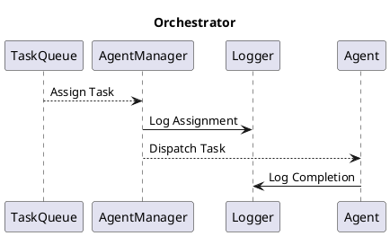

Architect is built around several core components that interact to provide a scalable and modular framework. Below is an overview of these components:

## Orchestrator

The orchestrator acts as the central hub for managing tasks and agent interactions.

The orchestrator ensures task routing, error handling, and logging are handled effectively.
