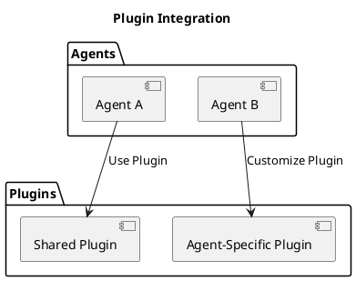

Plugins in Architect extend the functionality of agents and provide reusable logic for various tasks. They can be shared across agents or customized for specific needs.

## Plugin Architecture

### Shared Plugins

Shared plugins are reusable across multiple agents and provide generic functionality, such as data transformation or logging.

### Agent-Specific Plugins

Agent-specific plugins are tailored to the requirements of individual agents, enabling specialized behavior and integration.

By leveraging plugins, Architect ensures modularity and reduces code duplication.
