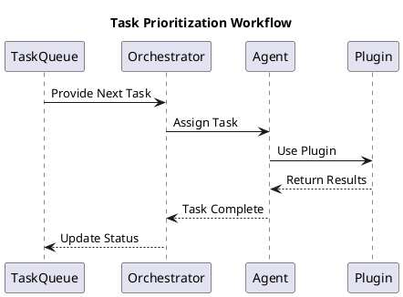

# Task Prioritization and Flow

Tasks move through a lifecycle from creation to completion, with the orchestrator ensuring efficient management and execution.

## Task Lifecycle

1. **Task Creation**: Tasks are added to the queue, either manually or by external triggers such as user requests or system events.
2. **Prioritization**: Tasks are assigned priority levels based on urgency, dependencies, and predefined rules.
3. **Assignment**: The orchestrator evaluates the task and matches it with the most suitable agents.
4. **Execution**: Agents and plugins collaborate to complete the task, utilizing necessary resources.
5. **Completion**: Results are logged, delivered back to the user or system, and used to update task status.

## Workflow Diagram

## Key Features

- **Dynamic Prioritization**: Tasks are reordered dynamically based on changing system conditions or user input.
- **Scalability**: The system can handle a large number of tasks by efficiently distributing them across available agents.
- **Logging and Monitoring**: Each task’s progress and status are logged for transparency and troubleshooting.

## Example Use Case

Imagine a user submits a task to analyze sales data:

1. **Task Creation**: The task is added to the queue.
2. **Prioritization**: The orchestrator identifies this as a high-priority task due to a reporting deadline.
3. **Assignment**: An agent equipped with data analysis plugins is selected.
4. **Execution**: The agent uses the plugins to process the sales data.
5. **Completion**: Results are returned to the user, and the task is marked as complete.
   This system ensures timely and efficient handling of tasks, maintaining a high standard of reliability and performance.
